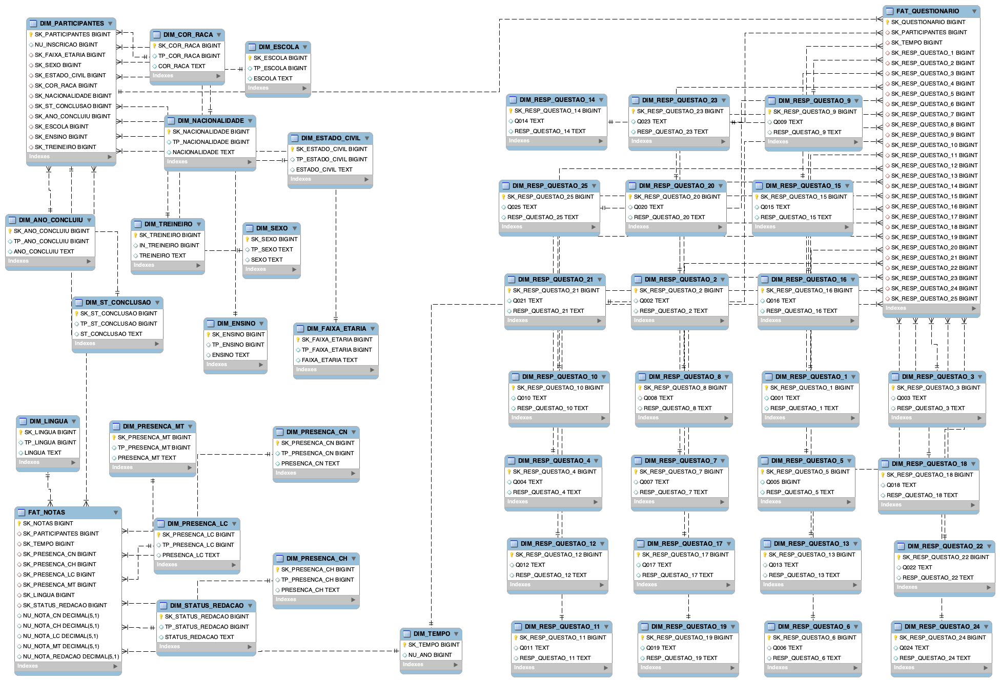

# ECM401 - Projeto de Business Intelligence - DataMart

Projeto de Business Intelligence - DataMart para a disciplina **ECM401 - Banco de Dados**, ministrada pelo professor [Antônio Guardado](https://www.linkedin.com/in/antonio-fernando-nunes-guardado-7bb40b135/).

# Sumário
- [1) Objetivos do projeto](#1-objetivos-do-projeto)
  - [Dataset](#dataset)
- [2) Importação dos microdados](#2-importação-dos-microdados)
- [3) Modelo da base operacional (OLTP)](#3-modelo-da-base-operacional-oltp)
- [4) Modelo dimensional - DataMart (DM)](#4-modelo-dimensional---datamart-dm)
- [5) ETL](#5-etl)
- [6) Consultas analíticas](#6-consultas-analíticas)
- [7) Visualização dos dados](#7-visualização-dos-dados)
- [Como rodar o projeto](#como-rodar-o-projeto)
  - [Vídeo com passo a passo](#vídeo-com-passo-a-passo)
  - [Instruções - VS Code](#instruções---vs-code)
  - [Como criar um ambiente virtual](#como-criar-um-ambiente-virtual)
    - [Unix](#unix)
    - [Windows](#windows)
- [Autores](#autores)

# 1) Objetivos do projeto

O objetivo do projeto é criar um DataMart a partir dos microdados do ENEM 2023, com a finalidade de:

- Extrair tendências que possam auxiliar no desenvolvimento de políticas públicas educacionais e sociais, como a identificação de desigualdades regionais no desempenho dos estudantes.
- Analisar o impacto de variáveis socioeconômicas, como renda familiar, tipo de escola (pública ou privada) e nível de escolaridade dos pais, para compreender como esses fatores influenciam o desempenho dos participantes.

## Dataset

O dataset utilizado foi a base de microdados do ENEM 2023, disponível nesse link: [Microdados do ENEM 2023](https://www.gov.br/inep/pt-br/acesso-a-informacao/dados-abertos/microdados/enem)

# 2) Importação dos microdados

Os microdados do ENEM 2023 foram importados para o MySQL, utilizando o Python e as biblioteca `pandas` e `sqlalchemy`. Os scripts estão disponíveis nos notebooks abaixo:

- [Script de importação do dicionário dos microdados do ENEM 2023](./src/1%20-%20Importar%20dicionário%20de%20microdados.ipynb)
- [Script de importação dos microdados do ENEM 2023](./src/2%20-%20Importar%20microdados.ipynb)

# 3) Modelo da base operacional (OLTP)

O modelo OLTP foi criado com base no dataset do ENEM 2023, com a finalidade de armazenar os dados de forma normalizada. Arquivo de exportação do MySQL Workbench `.mwb` está disponível [aqui](./modelos/Modelo-OLTP.mwb).


# 4) Modelo dimensional - DataMart (DM)

O modelo dimensional foi criado com base no modelo OLTP, com a finalidade de otimizar as consultas e análises de dados. Arquivo de exportação do MySQL Workbench `.mwb` está disponível [aqui](./modelos/Modelo-DM.mwb).



# 5) ETL

O processo de ETL foi realizado com o uso de scripts Python e SQL, disponíveis nos notebooks abaixo:

- [Script de ETL para criação das tabelas dimensionais a partir do dicionário de microdados](./src/3%20-%20ETL%20do%20dicionário%20de%20microdados.ipynb)
- [Script de ETL para criação das tabelas fato e dimensões a partir dos microdados](./src/4%20-%20ETL%20dos%20microdados.ipynb)

# 6) Consultas analíticas

Foram criadas cinco consultas com funções analíticas, contendo dois ou três agrupamentos, disponíveis no [seguinte notebook](./src/5%20-%20Selects%20analíticos.ipynb) ou podendo ser vistas no exemplo em HTML [aqui](./exemplos/5%20-%20Selects%20analíticos.html). 

# 7) Visualização dos dados

Com o uso das bibliotecas `pandas`, `numpy` e `matplotlib` do Python, criamos seis gráficos com as informações extraídas dos microdados. As visualizações podem ser executadas no [seguinte notebook](./src/6%20-%20Visualização%20dos%20dados.ipynb) ou vistas no exemplo em HTML [aqui](./exemplos/6%20-%20Visualização%20dos%20dados.html).

# Como rodar o projeto

## Vídeo com passo a passo

[](https://youtu.be/NzI7v51CfVo)

***Obs:** no vídeo não foi mencionado como criar um ambiente virtual para instalar as dependências, mas as instruções podem ser encontradas [aqui](#como-criar-um-ambiente-virtual).*

## Instruções - VS Code

1. Coloque o arquivo baixado `MICRODADOS_ENEM_2023.csv` na pasta `datasets/` na raiz do projeto.
2. Rode o servidor MySQL localmente. Duas opções fáceis são:
   1. Usando o MySQL Server
   2. Usando imagem Docker do MySQL
      1. Baixe a imagem do MySQL:
         ```bash
         docker pull mysql
         docker run --name mysql -e MYSQL_ROOT_PASSWORD=root -dp 3306:3306 mysql
         ```
> A URL será `localhost` com usuário `root` e senha `root` e a porta `3306`.

3. Crie os schemas no MySQL. Duas opções fáceis são:
   1. Usando o MySQL Workbench
   2. Rodando via CLI os scripts SQL abaixo:

```sql
CREATE SCHEMA `ENEM_OLTP`;
CREATE SCHEMA `ENEM_DM`;
```

4. Crie um ambiente virtual e instale as dependências. Veja como criar um ambiente virtual [aqui](#como-criar-um-ambiente-virtual).
5. Instale as extensões do `Jupyter Notebooks` disponíveis nesse [link](https://marketplace.visualstudio.com/items?itemName=ms-toolsai.jupyter).
6. Rode o script dentro dos notebooks numerados de 1 a 6.

## Como criar um ambiente virtual

Esteja no diretório do projeto e crie um ambiente virtual para instalar as dependências do projeto.

### Unix

```bash
python3 -m venv .venv
source .venv/bin/activate
pip install -r requirements.txt
```

### Windows

```bash
python -m venv .venv
.venv\Scripts\activate
pip install -r requirements.txt
```

# Autores

- [Enzo Sakamoto](https://linkedin.com/in/enzosakamoto)
- [Flavio Murata](https://linkedin.com/in/02mrt/)
- [Vinicius Berti](https://linkedin.com/in/vinicius-berti-a80354209/)